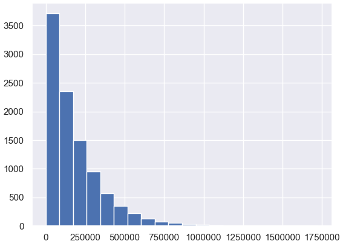
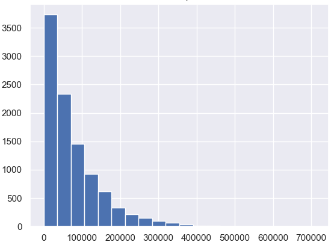
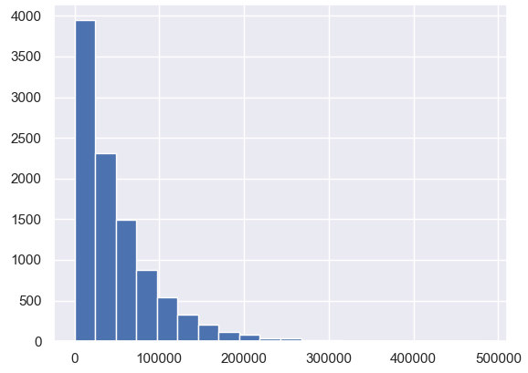

# Genetic Algorithm vs. Random Agent
This research project sets out to prove that Genetic Algorithms can be implemented to generate solutions efficiently. The toy problem being used for this project is the 8 Queens problem, where 8 queens must be placed on a chess board such that no queen is capable of capturing any other queen. The performance of the genetic algorithm (GA) is compared to the performance of a random agent. If the 8 Queens problem can be solved by the GA faster than the random agent on average, then the GA is efficient.
___
### Random agent:
The random agent is the control, for which every GA solution is compared to. A queen is placed randomly on each row of the board. It keeps running until it finds a goal state.

### Genetic Algorithm:
The genetic algorithm employs GA techniques to be as fast as possible at finding a solution. It is different for every trial.
___
## Trials
___
### Control
* (10,000 RA solutions)
#### Random Agent Algorithm
1. Randomly generate column to place queen in row
2. Repeat step 1 for each row of the board
3. Check to see if any queen can capture another queen
4. Repeat steps 1-3 until a goal state is achieved
#### Results
* Mean average of attempts to find goal state: 182556
* Histogram:

___
### Trial 1
* (10,000 GA solutions)
#### Genetic Algorithm
1. Create and execute 100 random chromosomes
2. Get the best 20% (determined by number of conflicts)
3. Splice them randomly
4. Execute 20 spliced chromosomes
5. Get the best 20%
6. Splice them randomly
7. Execute 4 spliced chromosomes
#### Results
* Mean average of attempts to find goal state: 75848
* ~2.4x faster than the random agent
* Histogram:

#### Notes
1. The mean average number of attempts for the control to find a goal state was 2.4 times higher than trial one.
2. Although this is not recorded, from all of the executions that I watched most of the GA solutions seemed to be 2nd or 3rd generation (randomly spliced, not randomly generated).
3. The effectiveness of the fitness function seems apparent from trial one, both from the mean average of the data and the frequency of spliced chromosomes finding goal states.
___
### Trial 2
* (10,000 GA solutions)
* Due to the very high success rate of the fitness function, the best way to improve the speed of this genetic algorithm seems to be to put more emphasis on splicing the fittest chromosomes. The first trial would take the best chromosomes and splice them only once. If this didn't yield a positive result, it would crop the best solutions again. For trial 2, each time the fittest chromosomes are cropped, they are spliced multiple times before the best solutions are cropped.
#### Genetic Algorithm
1. Create and execute 100 random chromosomes
2. Get the best 20% (determined by number of conflicts)
3. Splice them randomly
4. Execute 20 spliced chromosomes
5. Repeat steps 2 through 4 four times
6. Get the best 20%
7. Splice them randomly
8. Execute 4 spliced chromosomes
9. Repeat steps 7-8 twice
#### Results
* Mean average of attempts to find goal state: 48936
* ~3.7x faster than the random agent
* Histogram:

#### Notes

___
###[Research and notes](https://github.com/RobbyB97/ga-research-project/blob/master/Research.md)
